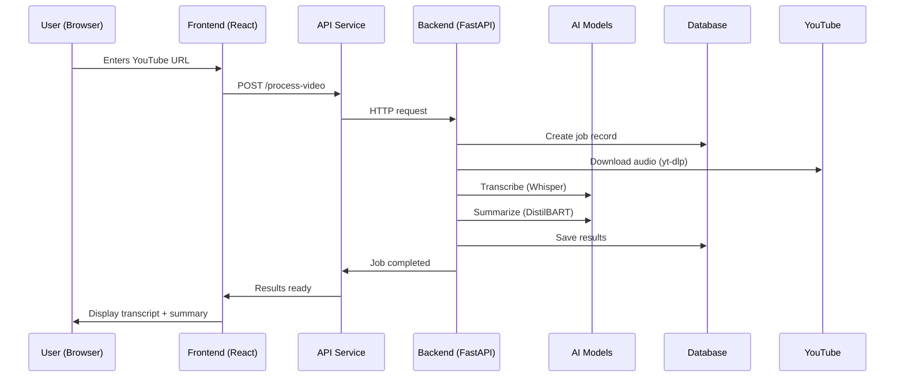

# 🏗️ Synapse Project Architecture

## 📊 **Complete System Overview**

Your Synapse project is a **full-stack AI application** with three main layers:

### **🎨 Frontend Layer (React + TypeScript)**
### **🔧 Backend Layer (Python FastAPI)**  
### **🤖 AI Layer (Local Models)**

---

## 🎨 **Frontend Architecture (frontend/)**

### **Technology Stack:**
- **Framework**: React 18 + TypeScript
- **Build Tool**: Vite (fast development)
- **Styling**: Tailwind CSS + shadcn/ui components
- **State Management**: React hooks + Context
- **Authentication**: Supabase Auth integration
- **Port**: 8080

### **📁 Frontend Structure:**
```
frontend/src/
├── pages/                    # Main application pages
│   ├── Index.tsx            # 🏠 Main processing interface
│   ├── Dashboard.tsx        # 📊 History & user data
│   ├── Auth.tsx             # 🔐 Login/signup forms
│   └── AccountSettings.tsx  # ⚙️ User preferences
│
├── components/              # Reusable UI components
│   ├── ToolInterface.tsx    # 🎬 YouTube URL input form
│   ├── ResultsDisplay.tsx   # 📄 Show transcripts/summaries
│   ├── Header.tsx           # 🧭 Navigation bar
│   └── ui/                  # 🎨 shadcn/ui component library
│
├── services/                # External integrations
│   └── api.ts              # 🔗 Backend API communication
│
├── hooks/                   # Custom React hooks
│   ├── useAuth.tsx         # 👤 Authentication logic
│   └── use-toast.ts        # 🔔 Notification system
│
└── integrations/            # Third-party services
    └── supabase/           # 🗃️ Database & auth client
```

### **🔄 Frontend Data Flow:**
```
User Input → ToolInterface → API Service → Backend → Results → ResultsDisplay
```

---

## 🔧 **Backend Architecture (backend/)**

### **Technology Stack:**
- **Framework**: FastAPI (Python 3.9)
- **Database**: SQLite (local development)
- **Authentication**: Supabase integration
- **AI Framework**: PyTorch + Transformers
- **Hardware**: M1 Pro MPS acceleration
- **Port**: 8000

### **📁 Backend Structure:**
```
backend/app/
├── main.py                  # 🚀 FastAPI application entry point
│
├── api/                     # REST API endpoints
│   ├── health.py           # 💚 System health checks
│   └── video_processing.py # 🎬 Main video processing API
│
├── models/                  # AI model management
│   └── model_manager.py    # 🤖 Whisper + DistilBART controller
│
├── services/                # Business logic
│   └── youtube_service.py  # 📺 YouTube video download & processing
│
└── database/                # Data persistence
    └── database.py         # 🗄️ SQLAlchemy models & operations
```

### **🔄 Backend Processing Flow:**
```
API Request → Job Creation → YouTube Download → AI Processing → Database Storage → Response
```

### **📡 API Endpoints:**
| Endpoint | Method | Purpose |
|----------|--------|---------|
| `/api/health` | GET | System status & model health |
| `/api/process-video` | POST | Start video processing job |
| `/api/job-status/{id}` | GET | Check processing progress |
| `/api/job-results/{id}` | GET | Get final results |
| `/api/jobs` | GET | User's processing history |

---

## 🤖 **AI Architecture (Local Models)**

### **Model Stack:**
- **Device**: Apple M1 Pro with MPS acceleration
- **Memory**: 16GB unified memory
- **Framework**: PyTorch 2.8.0 + Transformers

### **🧠 AI Models:**
```
Speech-to-Text Pipeline:
YouTube Audio → yt-dlp → FFmpeg → Whisper Small (244MB) → Transcript

Summarization Pipeline:  
Transcript → DistilBART CNN (306MB) → Intelligent Summary
```

### **⚡ M1 Pro Optimizations:**
- **MPS Backend**: GPU acceleration for neural networks
- **Unified Memory**: Efficient model loading
- **Async Processing**: Non-blocking inference
- **Model Caching**: Download once, use repeatedly

### **📊 AI Performance:**
| Component | Size | RAM Usage | Speed |
|-----------|------|-----------|-------|
| Whisper Small | 244MB | ~1GB | 2-3x real-time |
| DistilBART | 306MB | ~800MB | ~10 seconds |
| **Total** | **550MB** | **~2GB** | **Fast** |

---

## 🗄️ **Database Architecture**

### **Storage System:**
- **Type**: SQLite (local file)
- **Location**: `backend/synapse.db`
- **Size**: Currently 24KB (expandable)

### **📋 Database Schema:**
```sql
video_processing_jobs:
├── id (UUID)                    # Unique job identifier
├── user_id (String)             # User account linkage
├── video_url (String)           # YouTube URL
├── video_title (String)         # Video metadata
├── status (Enum)                # pending/downloading/transcribing/summarizing/completed/failed
├── transcript (Text)            # Full AI transcript
├── summary (Text)               # AI-generated summary
├── created_at (DateTime)        # Processing timeline
├── processing_time_seconds      # Performance metrics
└── whisper_model/summarization_model # Model versioning
```

---

## 🔗 **System Integration Flow**

### **Complete User Journey:**


### **🔄 Real-time Updates:**
```
Frontend polls → Backend status → Database updates → Progress displayed
```

---

## 🚀 **Deployment Architecture**

### **Current Setup (Development):**
```
Local Machine (MacBook M1 Pro 16GB):
├── Frontend Server (Vite) → Port 8080
├── Backend Server (FastAPI) → Port 8000  
├── Database (SQLite) → Local file
├── AI Models → Local cache (~/.cache/)
└── Authentication → Supabase (cloud)
```

### **🔧 Configuration Files:**
| File | Purpose |
|------|---------|
| `backend/.env` | Environment variables & model settings |
| `frontend/package.json` | Frontend dependencies |
| `backend/requirements.txt` | Python dependencies |
| `supabase/migrations/` | Database schema versions |

---

## 💡 **Key Architectural Decisions**

### **✅ What Makes This Architecture Great:**

1. **🏠 Local-First AI**: No API costs, full privacy, works offline
2. **⚡ M1 Pro Optimized**: Hardware acceleration for fast processing  
3. **🔄 Async Processing**: Non-blocking user experience
4. **📊 Complete History**: Everything stored locally in database
5. **🎨 Modern Frontend**: React + TypeScript + Tailwind
6. **🔐 Secure Auth**: Supabase integration for user management
7. **📱 Responsive Design**: Works on desktop and mobile
8. **🔧 Modular Design**: Easy to extend and modify

### **🎯 System Strengths:**
- **Zero ongoing costs** (after initial setup)
- **Fast processing** on M1 Pro hardware
- **Complete privacy** (local processing)
- **Professional UI** with modern components
- **Scalable architecture** for future features
- **Full-stack TypeScript** consistency

Your Synapse project is a **production-ready, self-hosted AI application** with excellent architecture for local deployment and future scaling! 🎉

